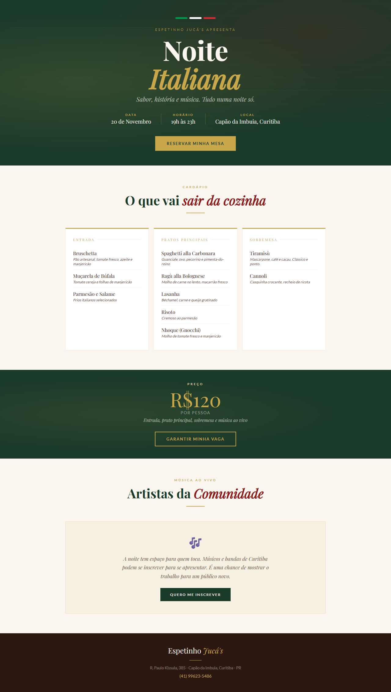
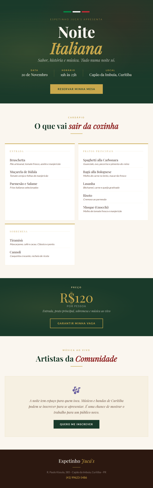
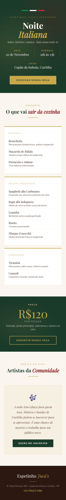

# Noite Italiana – Espetinho Jucá's

Landing page feita para a primeira Noite Italiana do Espetinho Jucá's, restaurante no Capão da Imbuia, em Curitiba.

O restaurante não possui site e divulgava tudo pelo WhatsApp atualmente. Essa página resolve isso.

**[Ver ao vivo](https://noite-italiana-jucas.vercel.app/)**

---

## Preview



<br/>

<div>
  
  
</div>

---

## O evento

Culinária italiana com pratos feitos na hora, sobremesas tradicionais e músicos da comunidade de Curitiba.

- Data: 20 de novembro
- Horário: 19h às 23h
- Local: R. Paulo Kissula, 385 - Capão da Imbuia, Curitiba/PR
- Valor: R$120 por pessoa

---

## O que tem na página

- Cardápio completo da noite
- Botão de reserva pelo WhatsApp
- Inscrição para músicos e bandas da comunidade
- Layout responsivo

---

## Tecnologias

- HTML5
- CSS3
- Google Fonts (Playfair Display e Lato)
- Deploy na Vercel

---

## Estrutura

```
noite-italiana-jucas/
├── index.html
├── assets/
│   ├── preview-desktop.png
│   ├── preview-tablet.png
│   └── preview-mobile.png
├── css/
│   └── style.css
└── README.md
```

---

## Contexto

Projeto desenvolvido para o **Projeto de Extensão II** do curso de CST em Análise e Desenvolvimento de Sistemas da Anhanguera. O objetivo era usar tecnologia para ajudar um negócio com atividade cultural — nesse caso, conectar gastronomia italiana com artistas locais de Curitiba.

---

## Autor

**Marcelo Tavares Mendes**
[GitHub](https://github.com/MarceloMendes021) • [LinkedIn](https://linkedin.com/in/marcelo021)
